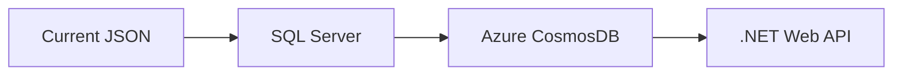
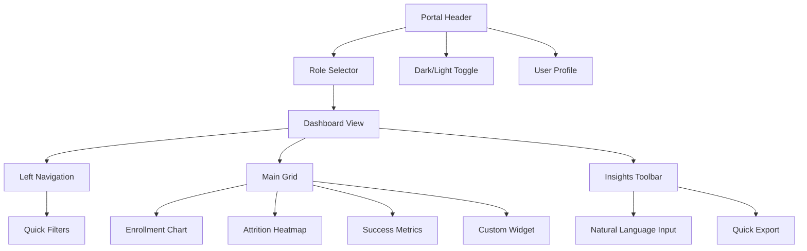
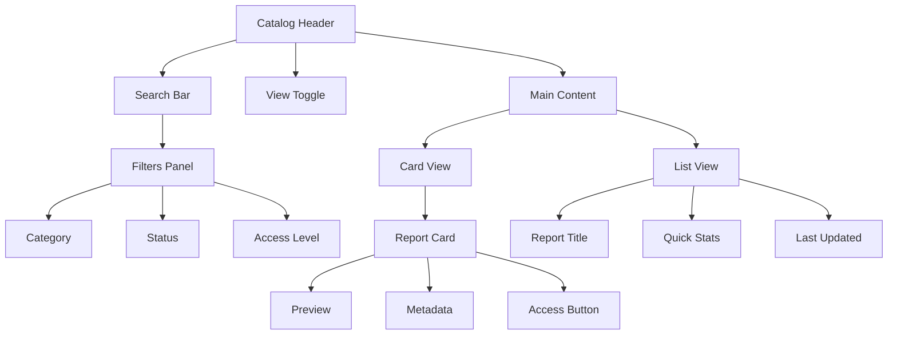
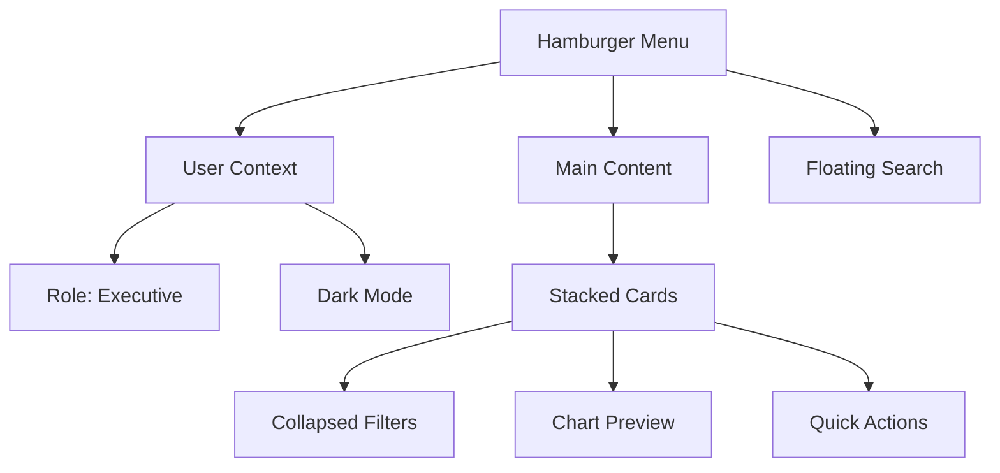

## Steps to run this Front-end application
Navigate to UniScStats Folder/src ---- open terminal and add the command

1.  npm run i (to install node dependencies)
2.  npm run dev (to run the application), open  http://localhost:8080/ in the browser.
   

# DataPortal3 Redesign Project - Requirements

## Project Overview
**Goal:** Redesign university data portal with role-based personalized dashboards, elegant visualizations, and on-demand insights for executive decision-making.

**Key Stakeholders:** University executives (VCP, Deans, Directors), ICT Team

## Objectives & Requirements

### Stage 1: Elegant Visualization & Dashboard Foundation
- [ ] Implement interactive chart library (PowerBI + ECharts integration)
- [ ] Create 5 core executive dashboards:
  - Enrollment Trends (Real-time)
  - Admissions Pipeline
  - Student Success Metrics
  - Attrition Heatmaps
  - Offer Acceptance Rates
- [ ] Develop responsive grid layout system
- [ ] Add dark/light mode toggle

### Stage 2: On-Demand Insights Engine
- [ ] Natural language query interface
- [ ] Pre-built quick analysis templates:
  ```json
  "quick_insights": [
    "ProgramComparison2024",
    "AttritionForecast",
    "EnrollmentProjection"
  ]
  ```
- [ ] Cache system for frequent requests
- [ ] Automated report generation (PDF/Excel)

### Stage 3: Role-Based Personalization
- [ ] Azure AD role integration matrix:
  | Role | Dashboard Access | Data Permissions |
  |------|------------------|------------------|
  | VCP | Full             | University-wide |
  | Dean | School-level     | Department-specific |
- [ ] Customizable widget system
- [ ] User preference storage (localStorage + cloud sync)

## Technical Specifications

### Authentication & Authorization (.NET 8)
```bash
# Create base project
dotnet new webapp -o DataPortal3 -au Individual
```
- [ ] Implement Azure AD integration
- [ ] Role-based policy configuration:
  ```csharp
  services.AddAuthorization(options => {
    options.AddPolicy("ExecutiveAccess", policy => 
      policy.RequireRole("VCP", "Provost", "Dean"));
  });
  ```
- [ ] Secure API endpoints with JWT
- [ ] Audit logging middleware

### Containerized Deployment
```dockerfile
# Test stage in Dockerfile
FROM mcr.microsoft.com/dotnet/sdk:8.0 AS test
RUN dotnet test /src/tests/DataPortal3.Tests

# Production build
FROM mcr.microsoft.com/dotnet/aspnet:8.0 AS final
USER 10001
ENTRYPOINT ["dotnet", "DataPortal3.dll"]
```

### PowerBI Integration
- [ ] Embedded authentication setup
- [ ] Report lifecycle management
- [ ] Cross-filtering between portal/PowerBI

## Development Notes

### ICT Intern Involvement Plan
1. Frontend module development (HTML/JS)
2. Style guide implementation
3. Basic chart configuration
4. Documentation tasks

### Migration Path


## Current Implementation Status

### Completed Features
✅ Client-side filtering/search  
✅ Basic dashboard framework  
✅ Static authentication  
✅ Chart.js integration

### Immediate Next Steps
1. Implement .NET authentication backend
2. Migrate data to Azure SQL
3. Create role-based access control
4. Develop API endpoints for:
   - Dynamic data loading
   - User preferences
   - Report metadata

## Testing Requirements
- [ ] Load testing (500+ concurrent users)
- [ ] Security penetration testing
- [ ] Cross-browser validation matrix
- [ ] Mobile responsiveness checklist

## Success Metrics
| Metric | Target | Measurement |
|--------|--------|-------------|
| Dashboard Load Time | <2s | Azure Monitor |
| Query Response | <5s | Application Insights |
| User Adoption | 85%+ | Google Analytics |
```


Here's a combined task list and Mermaid wireframe visualization for the MyUniSC Data Portal projects:

### Task List Roadmap

**Phase 1: Foundation Setup (Weeks 1-4)**
```markdown
- [ ] Set up Azure AD/EntraID authentication
- [ ] Create role matrix (VCP/Dean/Staff/ExecStaff)
- [ ] Develop base dashboard template
- [ ] Implement static JSON data source
- [ ] Build basic navigation structure
- [ ] Configure Azure Static Web App hosting
- [ ] Create security audit checklist
```

**Phase 2: Core Features (Weeks 5-8)**
```markdown
- [ ] Develop role-based view switching
- [ ] Implement PowerBI report embedding
- [ ] Build dynamic filter components
- [ ] Create search functionality
- [ ] Add dark/light mode toggle
- [ ] Set up basic usage analytics
```

**Phase 3: Enhancement & Testing (Weeks 9-12)**
```markdown
- [ ] Implement responsive grid system
- [ ] Add card/list view toggle
- [ ] Develop report metadata API
- [ ] Conduct load testing
- [ ] Perform security penetration tests
- [ ] Create user training materials
```

### Mermaid Wireframe Visualization

**Data Portal Dashboard View**


**Reports Catalog View**


**Mobile View**


Key UI Components Legend:
1. **Role-Based Color Coding**: Executive views use purple accents, staff views use blue
2. **Grid System**: 12-column responsive layout with card-based widgets
3. **Visual Hierarchy**: 
   - Primary Actions: Purple buttons
   - Secondary Actions: Gray outlines
   - Emergency Metrics: Red highlights
4. **Data Visualization**: 
   - Line charts for trends
   - Heatmaps for density patterns
   - Donut charts for quick stats

Would you like me to elaborate on any specific aspect of the wireframes or task prioritization?
